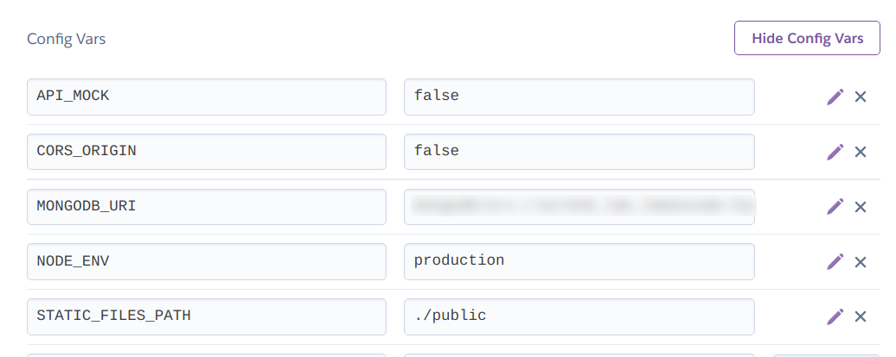

# Despliegue Manual de la App #

1. Generamos la carpeta dist con la app buildeada ejecutando dentro de la parte back del proyecto `npm run build`.

2. En la parte front ejecutamos de igual manera el script `npm run build`. Una vez tenemos hecha la build de la parte front, el contenido generado en la carpeta dist se copia y se pega en la carpeta public dentro de la parte back del proyecto.

3. Creación en la página de Heroku una nueva app.

4. Una vez creada la nueva app, en settings, cambiamos las variables de entorno tal y como aparecen en la imagen adjunta:

5. Clonamos en nuestro local el repositorio generado tras la creación de la nueva app.

6. Copiamos y pegamos el contenido de la carpeta dist en la parte back junto con la carpeta public y lo pegamos dentro del repositorio de Heroku. De esta manera haremos el deploy de nuestra app.

7. [URL de la APP desplegada](https://airbnb-lab-manual-mongo.herokuapp.com/)

